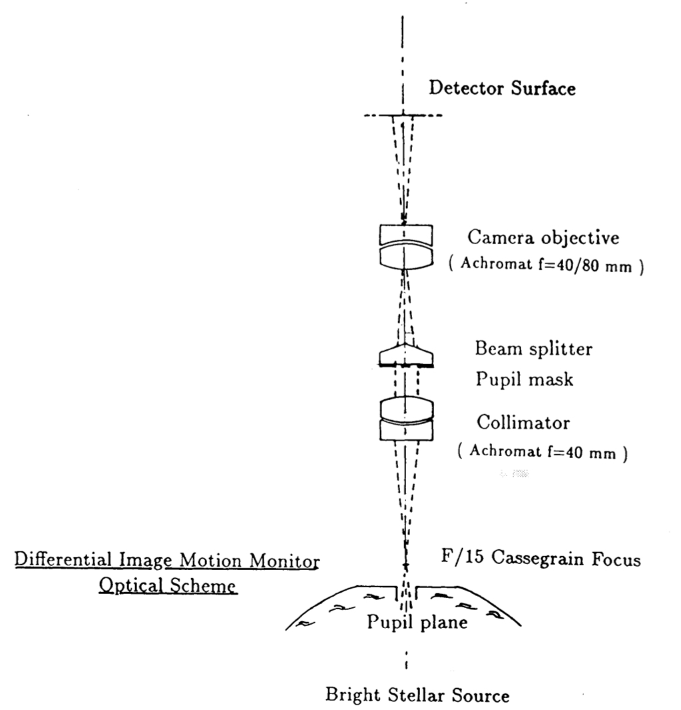
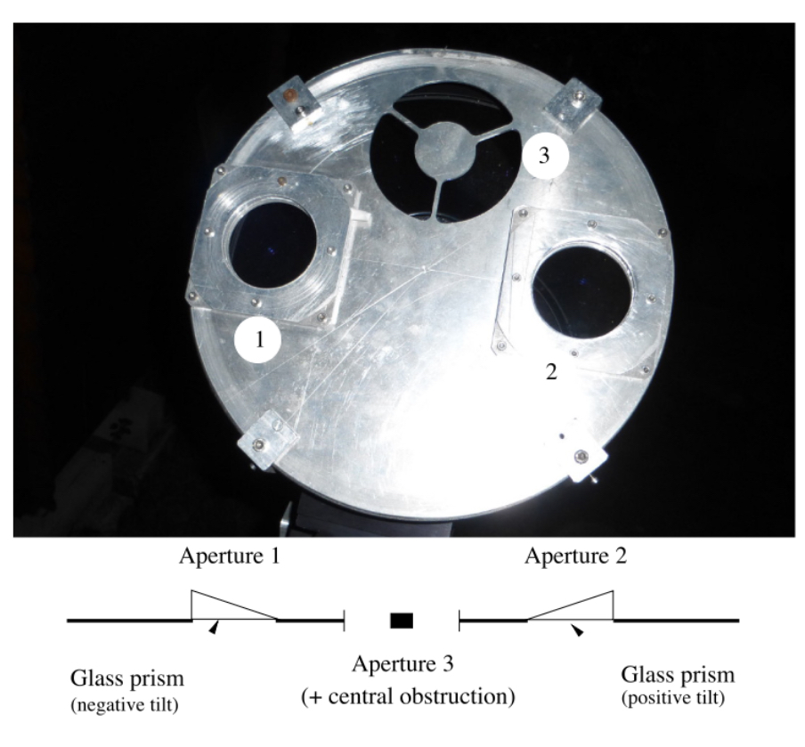

# Goal of this project 

The goal of this project is to build a Seeing Monitor, do-it-yourself - inexpensive at best. Or to put it as a research question: 

What does it take to build a "Real Seeing Monitor"? 

- where "Real" means, that we are measuring "real seeing", i.e. some parameter that is an indicator of the actual turbulence present in the atmosphere,
  such as the Fried-parameter \(r_0\) of Kolmogorov turbulence or some surrogate of that published in research literature
- where "Seeing" means the turbulence that directly influences the FWHM[^1] or HFR[^2] of stars in an astrophotography image during long exposures,
- where "Monitor" means that this parameter is measured in an autonomous fashion during the night, such that image quality can be related to this. 

[^1]: FWHM = Full Width Half Maximum, a measure related to "bloatedness" of stars in an image.
[^2]: HFR = Half Flux Radius, another measure related to "bloatedness" of stars in images.

## The Why

There's a lot of hodge-podge and hand-waving associated with [AutoGuiding](https://en.wikipedia.org/wiki/Autoguider) and 
tracking and monitoring the RMS values during the imaging night: "Good guiding" is by common convention associated with 
having RMS values on the order of 0.5 arcsec. In contrast other's being able to purchase expensive encoder mounts, do not pay attention to Guiding at all, save for 
detecting the occasional slip or the tugging of cables. 

My own measurements showed that, while a very large Periodic Error (on the order of 10s of arcsec), that cannot be guided out completely is associated 
with blown up stars in subs, the situation is less clear with regard to RMS values <2 arcsec. 
While there is correlation, the correlation is not crystal clear (R² = 0.3). 

Thus having an independent, inexpensive,  measurement of "Seeing", will help improve astrophotography not only for me, but for the community at large.

## Literature Overview for Seeing Monitors

### DIMM - Differential Image Motion Monitor

The paper that is cited by most Seeing Monitor literature is by Sarazin and Roddier from 1990 [[1]](#1). They describe the
"Differential Image Motion Monitor" (DIMM), "the method consists of measureing wavefront slope differences over two small pupils 
some distance apart." This technique has been used since the 1960s. "[It] is the main element of the instrumentation package developed 
for the VLT site evaluation campaign. [...] Three DIMMs are now in routine operation on candidate sites in Chile. They use 35 cm diameter 
telescopes in the open air on 5 m high towers." It uses a pupil mask and prism in an afocal configuration to create to images of the same star
on the detector: The picture in the focal plane is sent from the collimator (ocular) into a pupil mask + beam deflector („Beam splitter“, two prisms), to create two images of a star on the detector surface.
The statistics of the relative motion of these two images is then used to determine seeing. 

Figure 2 from [[1]](#1): 

### DIMM with Wedge prism

Aristidi et. al. [[2]](#2) instead use a wedge prism in front of the telescope's aperture ("Generalised DIMM"). The earliest mention of this concept I 
found is from 1995 in [[3]](#3). The wedge prisms used form a total deflection angle of \(\approx 1.0 \pm 0.1\) arcmin.

Figure 1 from [[2]](#2):

### Other operating principles.

One can find other operational principles for Seeing Monitors in literature. Among these: 

- SHIMM - using a Shack Hartmann Wavefront Sensor
- Hartmann DIMM - using a hartmann mask and defocusing
- Radar or laser based methods
- Interference based methods

Using the respective keyword and seeing monitor, one should be able to find literature online.

## First Experiment

> **Build a DIMM using off-the-shelf components with an 8 inch telescope.**

## References 

<a id="1">[1]</a> M. Sarazin and F. Roddier, "The ESO differential image motion monitor", 1990, Astronomy and Astrophysics, 
[online](https://ui.adsabs.harvard.edu/abs/1990A&A...227..294S/abstract), last accessed 2024-12-26

<a id="2">[2]</a> E. Aristidi, A. Ziad, J. Chabé, Y. Fantei-Caujolle, Cédric Renaud, C. Giordano, "A generailzed differential 
image motion monitor", Monthly Notices of the Royal Astronomical Society, 2019, 486 (1), pp. 915-925. doi:10.1093/mnras/stz854, 
[online](https://hal.science/hal-02283284v1) last accessed 2024-12-27

<a id="3">[3]j</a> J. Vernin, C. Munoz-Tunon, "Measuring Astronomical Seeing: The DA/IAC DIMM", Publications of the Astronomical 
Society of the Pacific, 107: 265-272, 1995, [online](https://iopscience.iop.org/article/10.1086/133549/pdf) last accessed 2024-12-27
