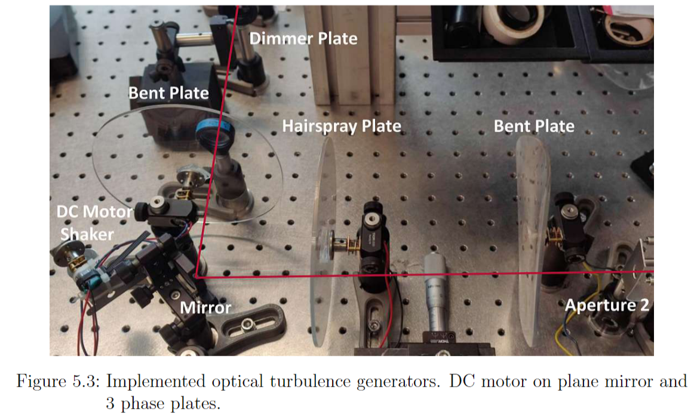

# Simulation of Seeing

In his Diploma thesis Jakob Maislinger describes, how he tried to reproduce the seeing present in a recording of a satellite [[1]](#1). He used 
two different devices: 

- A DC motor shaker afixed to a mirror
- Discs made from acrylic glass, light going perpendicular through them, where DC motors are used to rotate them. Treated with
    - a heat gun, to deform them in the plane of the disks
    - hair spray

Here's picture of his setup:

According to figure 5.1 in [[1]](#1), the main frequency of the motor shaker is 31-32 Hz.
Unfortunately he does not give the frequency of rotation for the phase plates. In reference 51 of [[1]](#1) (see [[2]](#2)), the authors derived apparant wind velocities from the simulated seeing and 
attributed these velocities to the rotation speed of the discs. Their design target was to simulate mean wind velocities of 8.3 m/s. 
The rotation speed of the 200 mm diameter discs was 17.5 rpm, The beam's middle hit the rotating disc at a radius of 70 mm, and with 17.5 rpm, that means the linear velocity 
at that point was \( 2\ \pi\ 70\ \textrm{mm} \cdot 17.5\ \textrm{Hz} = 7.7\ \textrm{m/s} \). Roughly 10% less as the design target and in fact the wind velocity they determined from the simulation 
was roughly 10% less than expected.

With regard to preparation of the disks Jakob writes: 

> The process of creating a phase screen is a science on its own. Too much heat from a heat gun produces bubbles 
> or distortions that are too large for a proper [wavefront sensor] measurement. Thin plexiglass plates are more susceptible for errors 
> and therefore only thicker plates are used. Applying too much hairspray leads to too much distortion, 
> which results in interruptions in the WFS measurement. Additionally, if some dirt or dust sticks to the plate while heating or hair spraying 
> the plate, the shadow of such defects makes the plate unusable.

For other options, how to simulate seeing see references 49-54 in [[1]](#1).

## References

<a id="1">[1]</a> J. Maislinger, "Adaptive Optics for Small Telescope Systems", 2023, Diplomarbeit TU Wien, [Online](https://doi.org/10.34726/hss.2023.81180), last accessed 2024-12-26

<a id="2">[2]</a> J. Y. Joo, S. G. Han, J. H. Lee, H.-G. Rhee, J. Huh, K. Lee, S. Y. Park, "Development and Characterization of an Atmospheric Turbulence Simulator 
using Two Rotating Phase Plates", 2022, Current Optics and Photonics, Vol 6. Issue 5, pp. 445-452